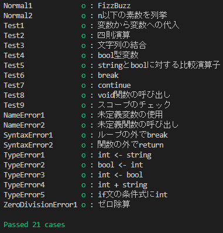

# CLS4(開発中)

C言語ライクな文法とシンプルさの両立がコンセプトである、
静的型付けなインタプリタ型のプログラミング言語です。

インタプリタ型の言語でありながら、変数の型指定が必須、if文やwhile文の条件式にbool型以外を指定できないなど、手軽に記述できてかつバグの生じにくい言語です。

現在使用可能な型は以下です。
- int
- string
- bool

現在はwhile文とif-else文、break文とcontinue文、引数無し戻り値無しの関数などが使用できます。

CLS4という名前の由来は「**C**-**L**ike **S**imple and **S**afe **S**tatic-typing **S**cript」です。

文法を[grammer.txt](grammer.txt)に記述しています。

## 実行方法

### ビルド
`make`

### 実行

#### Windowsの場合
`cls4 ソースファイル.cls4 [構文木出力ファイル.txt]`

#### Unix系OSの場合
`./cls4 ソースファイル.cls4 [構文木出力ファイル.txt]`

### ユニットテスト
`python unittest.py`

- ソースコード：[unittest/src](unittest/src)
- 実行結果の格納先：[unittest/out](unittest/out)
- 標準入力(必要であれば)：[unittest/stdin](unittest/stdin)
- 期待される出力：[unittest/ans](unittest/ans)
- ソースコードから得られた構文木：[unittest/tree](unittest/tree)

## ソースコードの説明
|ファイル名|内容|
|-|-|
|[cls4.cpp](cls4.cpp)|メインプログラム|
|[Token.cpp](Token.cpp)/[Token.h](Token.h)|字句を表すクラス|
|[TokenList.cpp](TokenList.cpp)/[TokenList.h](TokenList.h)|字句解析器/字句の集合を表すクラス|
|[Node.cpp](Node.cpp)/[Node.h](Node.h)|構文木のノードを表すクラス|
|[SyntaxTree.cpp](SyntaxTree.cpp)/[SyntaxTree.h](SyntaxTree.h)|構文解析器/構文木を表すクラス|
|[Interpreter.cpp](Interpreter.cpp)/[Interpreter.h](Interpreter.h)|インタプリタ(仮想マシン)を表すクラス|
|[Object.cpp](Object.cpp)/[Object.h](Object.h)|CLS4のオブジェクトを表すクラス|
|[SymbolTable.cpp](SymbolTable.cpp)/[SymbolTable.h](SymbolTable.h)|CLS4のオブジェクトの空間を表すクラス|
|[Function.h](Function.h)|CLS4の関数を表すクラス|
|[Type.h](Type.h)|CLS4の型を表すクラス|
|[Error.cpp](Error.cpp)/[Error.h](Error.h)|CLS4のエラーを表すクラス|

## 実行例

### ソースファイル ([unittest/src/Normal2.cls4](unittest/src/Normal2.cls4))
```C
// n以下の素数を列挙
int i = 2, n = input_int();
while(i <= n){
    int j = 2;
    bool is_prime = true;
    while(j <= i / 2){
        if(i % j == 0){
            is_prime = false;
            break;
        }
        j += 1;
    }
    if(is_prime){
        print(i, " ");
    }
    i += 1;
}
```

### 標準入力
```
100
```

### 実行結果
```
2 3 5 7 11 13 17 19 23 29 31 37 41 43 47 53 59 61 67 71 73 79 83 89 97 
```

### ユニットテスト

各テストプログラムの説明を[unittest/README.md](unittest/README.md)に記載しています。



## 製作期間

2021年7月～

学部3年の後期(2020年10月～2021年2月)に、
Pascalサブセットの簡易的なコンパイラをJavaを用いて作成する授業があり、
その経験からインタプリタの作成に興味を持ちました。

2021年7月頃に簡易的なインタプリタを開発しました。

大学院入試や研究などにより開発を中断していましたが、2022年9月に改修を行い、GitHubに公開しました。

## 構文解析器ジェネレータ(今後の展望)

将来的に構文解析器を自動生成することを考えています。

難易度が高いため保留しています。

[parser-gen](parser-gen)
